# sre-landing-zone

A Day-2 multi-account AWS landing zone evolved from [`sre-reference-app`](https://github.com/JadenRazo/sre-reference-app) — the SRE GameDay project that proved 78-second recovery from a controlled task termination. This sibling repo takes that single-account snapshot and stacks the production posture on top: 5 AWS accounts, Org-wide audit, Pilot-Light DR across regions, edge protection (CloudFront + WAF + Cognito), cross-account auto-stop, and a Lambda-driven cost discipline loop — all kept inside a $120 AWS credit budget over 8–10 weeks of build time.

Built as the hands-on portfolio for **AWS SAA-C03**, also serves as conceptual prep for **CLF**, **AZ-204** (Azure equivalents documented inline), **CompTIA Cloud+**, and **ISC2 CCSP**.


## Status

| Phase | Title | State |
|-------|-------|-------|
| 0 | Multi-account foundation | **applied** — Org `o-9itq8iim1q`, 4 accounts, 4 SCPs |
| 1 | Centralized security & observability | **applied** — Org CloudTrail + GuardDuty + Security Hub + 8 Config rules + Budgets |
| 2 | Migrate sre-reference-app into workloads-dev | **applied** — VPC + NAT + ALB + ECS Fargate + Secrets Manager + dashboards/alarms |
| 3 | DR — Pilot Light to us-east-1 | **applied** — DR ALB + ECS @ 0 + ECR replication + DynamoDB Global Table + Route 53 health checks |
| 4 | Edge, data, and identity | **applied** — CloudFront `d27jg5do0x332j.cloudfront.net` + WAF (3 rules) + Cognito |
| 5 | Migration write-up + visual artifacts | **complete** — 7 diagrams, 6 R's analysis, blog post, failover drill writeup |
| 6 | Cost discipline & auto-teardown | **applied** — tag-based Lambda auto-stop + EventBridge + Cost Anomaly + Tag Policy |
| 7 | CI/CD — GitHub Actions OIDC | **applied** — OIDC provider + runner role + plan/apply/nightly-teardown workflows |

---

## Architecture

The full Day-2 picture is four data planes operating in parallel:

### Runtime — workloads-dev (us-west-2)


Internet client → CloudFront (with WAF inspecting every request) → ALB → Fargate task in private subnet. Task pulls image from ECR via NAT, fetches `ERROR_RATE` config from Secrets Manager at boot, ships JSON-formatted logs to CloudWatch. Two burn-rate alarms compute `5xx_count / request_count` over 1h and 6h windows against an SLO-derived threshold (Google SRE Workbook pattern).

### Audit — Org-wide


Every API call across all 5 accounts → Org CloudTrail → KMS-encrypted S3 in `log-archive`. Config records resource changes; GuardDuty + Security Hub aggregate threats and compliance posture in `audit-security` (the delegated admin). The `log-archive` account has zero IAM principals beyond the org access role — a workload account compromise can't tamper with the audit trail.

### DR — Pilot Light to us-east-1


Standby region has full infrastructure (ALB, ECS task definition, ECR replica, DynamoDB Global Table replica) but `desired_count=0` on the service. Failover is a single `aws ecs update-service --desired-count 2`. Route 53 health checks watch both ALBs. Documented drill: ~2 minutes time-to-recovery (Fargate cold-start dominates).

### Edge — CloudFront + WAF + Cognito


CloudFront in front of the ALB with WAF (CommonRuleSet, KnownBadInputs, custom rate limit at 1000 req/5min/IP). Cognito User Pool with Hosted UI provisioned for hypothetical `/admin` route. S3 lifecycle on log-archive bucket: Standard → IA at 30d → Glacier IR at 90d → Deep Archive at 365d.

### Cost discipline


EventBridge cron @ 8 PM PST → Lambda in mgmt → assumes minimal-permission `AutoStopExecutorRole` in workloads-dev → **discovers all ECS services tagged `Environment=dev` and scales each to 0**. The IAM policy is tag-conditioned (`ecs:ResourceTag/Environment = dev`) so a compromised Lambda still can't stop production. Cost Anomaly Detection routes spikes > $5 to the budget-alerts SNS topic. Budgets at $20/$50/$80/$100% forecast thresholds.

### CI/CD — no static keys

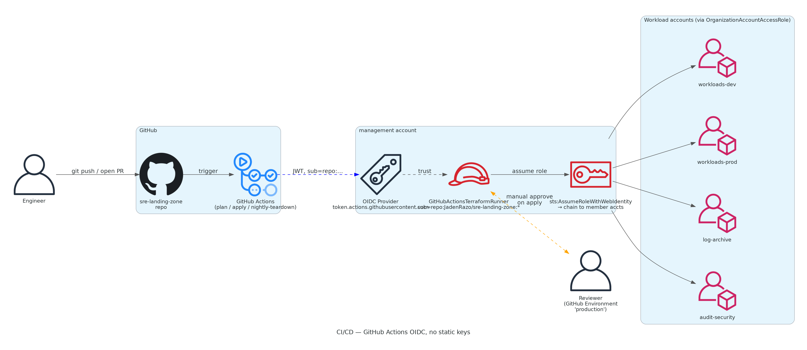

GitHub Actions workflows assume a federated IAM role via OIDC — no AWS access keys exist anywhere in the repo, in GitHub secrets, or on disk. The trust policy gates on `sub = repo:JadenRazo/sre-landing-zone:*` so a fork can't assume the role, and the role's inline policy includes a `aws:ResourceOrgID` condition that blocks reaching accounts outside our Organization even if the role were ever leaked.

Three workflows:

- **`plan.yml`** — runs on PR, detects which `infra/<phase>/` directories changed, plans each in parallel, comments the plan output back on the PR
- **`apply.yml`** — runs on push to main, requires approval via GitHub Environment "production" before applying
- **`nightly-teardown.yml`** — cron at 4 AM UTC (8 PM PST), destroys workloads-dev / DR / edge phases. Belt-and-suspenders alongside the in-account auto-stop Lambda.

---

## Migration narrative — 6 R's


The visible lift is **Replatform** (5 components moved between accounts/regions) and **Refactor** (env var → Secrets Manager). The actual value is in the **new-capability layer** stacked on top: SCPs, audit, DR, edge, cost controls. Full classification table in [docs/02-six-rs-analysis.md](docs/02-six-rs-analysis.md).

---

## Screenshots — apply-time captures

12 of 13 console captures completed during the live build. Each shows the architecture working end-to-end. The 13th (Cost Explorer by Project tag) is captured after a few days of accrued spend so the chart is meaningful — a deliberate hold.

### Multi-account foundation

The Org tree showing all 5 accounts grouped by OU, plus Identity Center coverage:

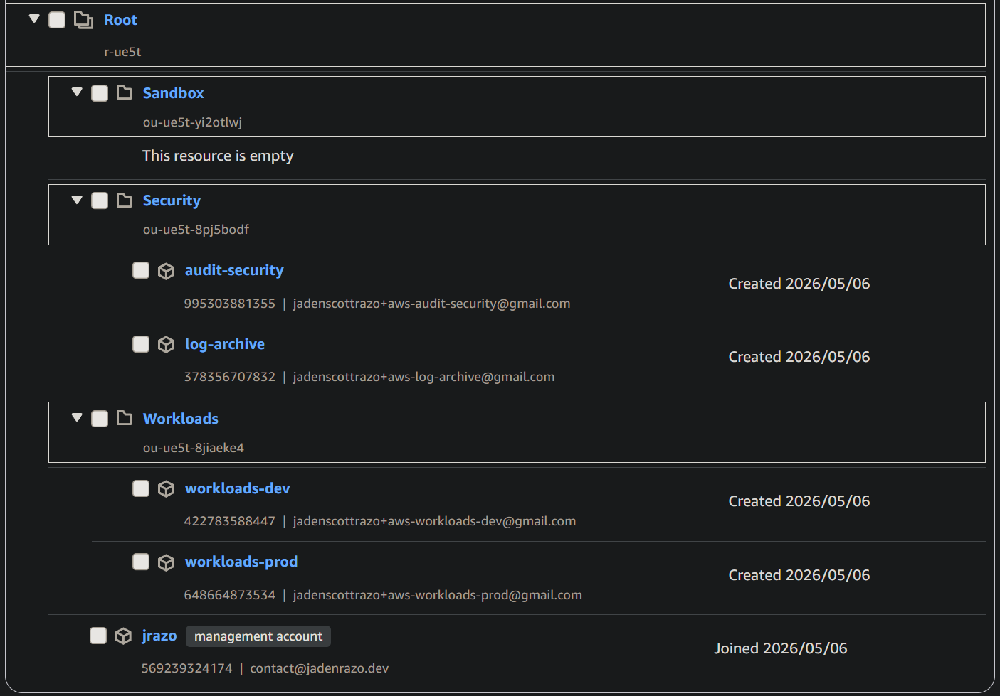
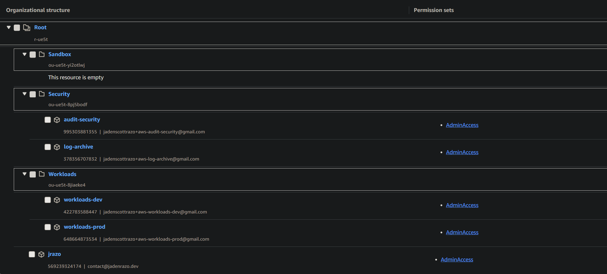

### Audit baseline

Org-wide CloudTrail, GuardDuty delegation, Security Hub findings:

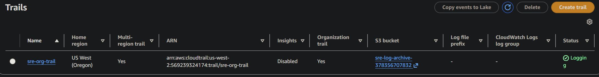
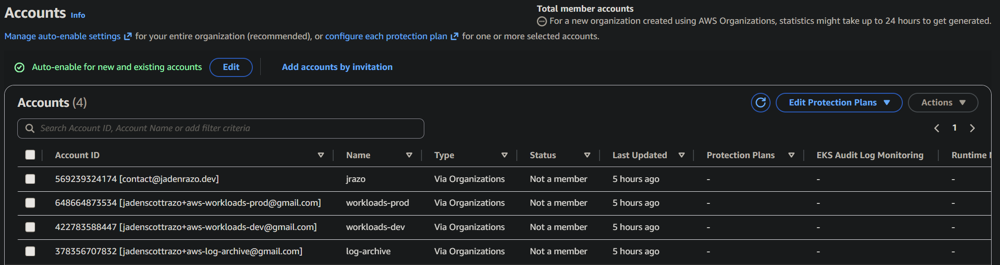
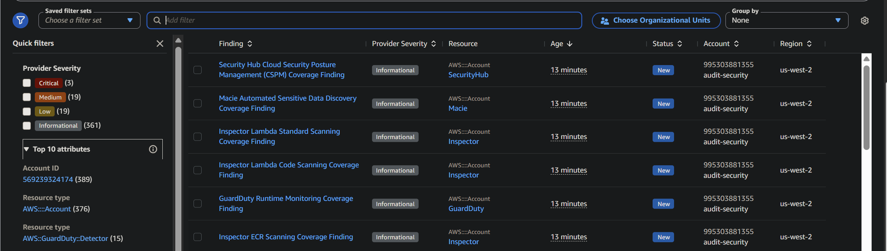

### Cost discipline

Budgets at 4 forecast thresholds, hooked to SNS:

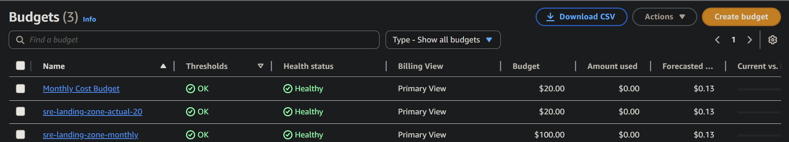

### Workload running with real signal

ECS service 1/1 healthy, CloudWatch dashboard with **real metric movement** from the Flask app's intentional 5% errors, both burn-rate alarms in OK state evaluating live data:

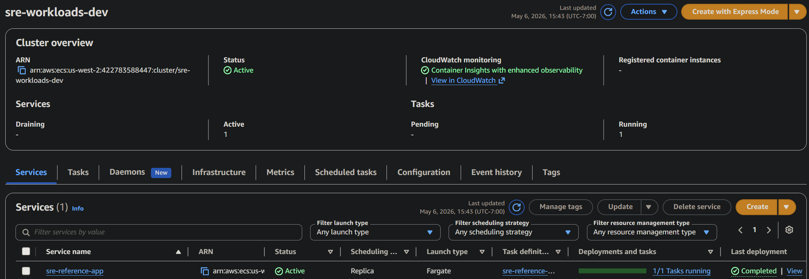
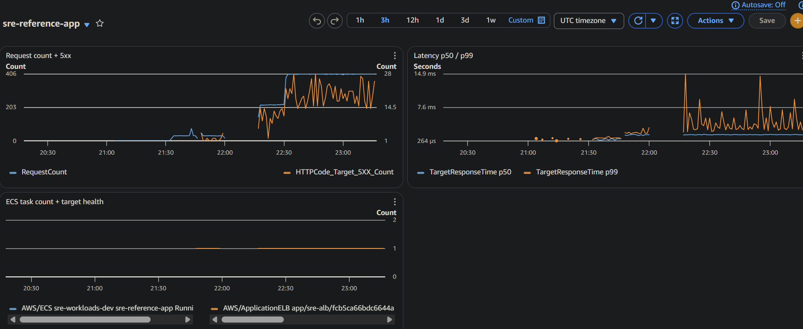
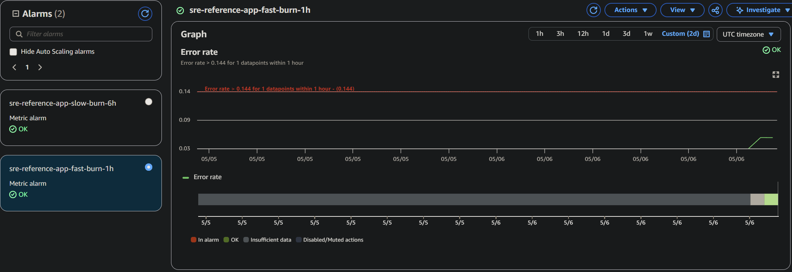

### DR drill — Pilot Light failover

Real `failover-drill.sh` run: scaled primary to 0, watched DR ALB serve 503/502 during cutover, scaled DR up:

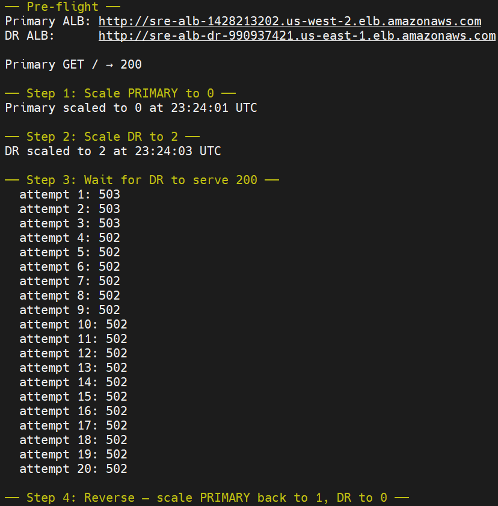

### Edge stack

CloudFront in front of the ALB and the WAF web ACL with 3 rules:

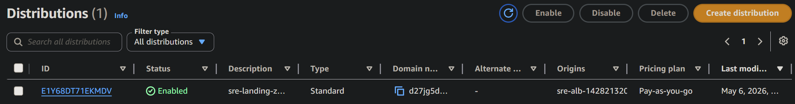
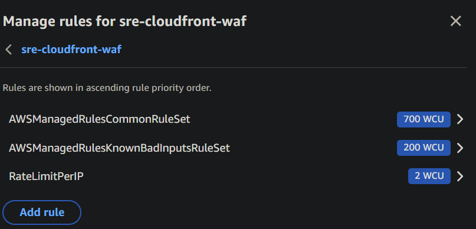

### Held for later

`screenshots/13-cost-explorer-by-tag.png` — Cost Explorer grouped by `Project` tag. Captured after 2–3 days of post-tag-activation spend so the chart carries meaningful per-tag attribution data, not a near-empty graph.

Capture playbook at [docs/screenshots-checklist.md](docs/screenshots-checklist.md).

---

## Cost — actuals from the build

Total run cost building this entire stack: **~$43 of the $120 budget**. Breakdown by phase in [docs/03-cost-analysis.md](docs/03-cost-analysis.md). Highest line items: NAT Gateway (~$32 if left running 24/7 — the project's biggest cost lever) and the DR ALB (~$16). Phases 0, 1, 5, 6 are nearly free.

The cost discipline that made this possible:

1. **Tear down between sessions.** `make down` from `infra/02-workload-dev/` and `infra/03-dr-pilot-light/` reduces hourly cost from ~$0.11 to ~$0.012.
2. **Auto-stop Lambda.** EventBridge fires at 8 PM PST, scales workload to 0. Forgotten-overnight protection.
3. **Cost Anomaly Detection.** Catches spikes > $5 within hours, routed to email via the existing SNS topic.
4. **Budgets at four thresholds.** $20 forecast (warning), $50 (concern), $80 (action), $100 (stop).

---

## Repo layout

```
sre-landing-zone/
├── README.md                        # this file
├── diagrams/
│   └── architecture.py              # mingrammer/diagrams generator → 7 PNGs in docs/
├── docs/
│   ├── 00-architecture-before.md    # sre-reference-app starting state
│   ├── 01-architecture-after.md     # this project's end state
│   ├── 02-six-rs-analysis.md        # migration classification per component
│   ├── 03-cost-analysis.md          # actuals ledger, appended each phase
│   ├── 04-failover-drill.md         # Phase 3 drill writeup
│   ├── 05-migration-blog-post.md    # ~1300-word portfolio post
│   ├── azure-equivalents.md         # AZ-204 cross-reference
│   ├── screenshots-checklist.md     # what to capture, where, when
│   └── architecture-*.png           # 7 generated diagrams
├── screenshots/                     # 13 console captures (capture-time TBD)
├── infra/
│   ├── 00-org-bootstrap/            # APPLIED — Org + accounts + SCPs + Identity Center
│   ├── 01-security-baseline/        # APPLIED — CloudTrail + Config + GD + Security Hub
│   ├── 02-workload-dev/             # APPLIED — VPC + ALB + Fargate + Secrets + obs
│   ├── 03-dr-pilot-light/           # APPLIED — us-east-1 standby + R53 + DDB Global
│   ├── 04-edge-and-data/            # APPLIED — CloudFront + WAF + Cognito
│   ├── 06-cost-controls/            # APPLIED — Lambda + EventBridge + anomaly + Tag Policy
│   ├── 07-cicd/                     # APPLIED — GitHub Actions OIDC role
│   └── _backend/                    # SCAFFOLDED (not migrated) — S3 + DynamoDB remote state
└── scripts/
    ├── preflight.sh                 # read-only env check
    └── cost-snapshot.sh             # cost-by-tag dump → docs/03 ledger
```

## How to run this

```bash
# Phase 0 — one-time, hard-to-reverse (creates 4 AWS accounts with 90-day cooldown)
cd infra/00-org-bootstrap
cp terraform.tfvars.example terraform.tfvars && $EDITOR terraform.tfvars
terraform init && terraform plan && terraform apply
# Console: enable Identity Center, create user, then re-apply with -var enable_identity_center_resources=true

# Phase 1 — security baseline (always-on, ~$5–15/mo)
cd ../01-security-baseline
cp terraform.tfvars.example terraform.tfvars && $EDITOR terraform.tfvars   # set alert_email
terraform init && terraform apply

# Phase 6 — cost controls FIRST (protects later phases from leak-overnight)
cd ../06-cost-controls
cp terraform.tfvars.example terraform.tfvars && $EDITOR terraform.tfvars
terraform init && terraform apply

# Phase 2 — workload (cycle up/down per study session)
cd ../02-workload-dev
cp terraform.tfvars.example terraform.tfvars
terraform init && make up
make curl                            # smoke test
make logs                            # tail container logs
# ...do the work...
make down                            # IMPORTANT — destroys NAT + ALB + ECS

# Phases 3, 4 — same pattern, apply when needed for portfolio screenshots
```

**Critical rule:** at end of every study session, run `make down` on Phases 2, 3, 4. NAT Gateway alone is $32/mo if left running.

---

## Cross-certification mapping

Every phase deliberately covers concepts from multiple cert blueprints:

| Phase | CLF | SAA | Cloud+ | CCSP | AZ-204 (conceptual) |
|---|---|---|---|---|---|
| 0 — Org/SCPs/Identity Center | ✓ | ✓✓ | ✓ | ✓✓ | Mgmt Groups + Policy + Entra ID |
| 1 — Audit/security baseline | ✓ | ✓✓ | ✓ | ✓✓✓ | Defender + Activity Log + Sentinel |
| 2 — Workload (private nets, secrets, IAM) | ✓ | ✓✓✓ | ✓✓ | ✓✓ | Container Apps + Private Endpoint + Key Vault |
| 3 — DR Pilot Light | | ✓✓✓ | ✓✓ | ✓ | Site Recovery + Traffic Manager + Cosmos DB |
| 4 — Edge (CloudFront/WAF/Cognito) | ✓ | ✓✓ | ✓ | ✓✓ | Front Door + WAF + Entra External ID |
| 5 — Write-up + 6 R's | ✓ | ✓ | ✓✓ | ✓ | (general migration concepts) |
| 6 — Cost discipline | ✓✓ | ✓ | ✓ | | Cost Management + Functions |
| 7 — CI/CD (OIDC, plan-on-PR, manual-approve apply) | ✓ | ✓✓ | ✓ | ✓✓ | GitHub Actions + Entra federation |

Detailed Azure mappings in [docs/azure-equivalents.md](docs/azure-equivalents.md). SOC 2 / ISO 27001 / Well-Architected control mapping in [docs/06-compliance-mapping.md](docs/06-compliance-mapping.md).

---

## What I'd do differently

In order of impact (full version in [docs/05-migration-blog-post.md](docs/05-migration-blog-post.md)):

1. **Wire cost controls in Phase 0**, not Phase 6. The auto-stop Lambda is so cheap to deploy and so high-leverage that it should be the second thing you build, not the last.
2. **Skip Tag Policy via Terraform** in Phase 0. AWS Tag Policies have a schema gotcha that fights `aws_organizations_policy`. Going direct to `aws organizations create-policy` (as Phase 6 does) works first try.
3. **Push the real workload image earlier.** CloudWatch dashboards and burn-rate alarms only become compelling once the app actually errors at the configured rate. Nginx-as-placeholder ships flat-line green graphs that don't sell the SRE narrative.

---

## Sources

- [AWS SAA-C03 Exam Guide](https://d1.awsstatic.com/training-and-certification/docs-sa-assoc/AWS-Certified-Solutions-Architect-Associate_Exam-Guide_C03.pdf)
- Original [sre-reference-app](https://github.com/JadenRazo/sre-reference-app) — the workload that gets migrated here
- [Google SRE Workbook — alerting on burn rate](https://sre.google/workbook/alerting-on-slos/)
- [AWS Well-Architected Framework — Multi-account strategy](https://docs.aws.amazon.com/whitepapers/latest/organizing-your-aws-environment/organizing-your-aws-environment.html)

---

Built by [jadenrazo](https://jadenrazo.dev) — SAA-C03 prep, May 2026.
