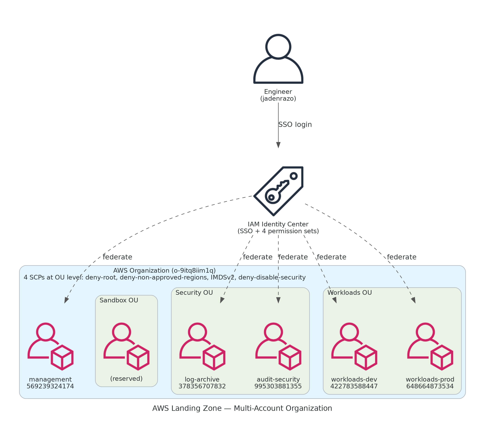
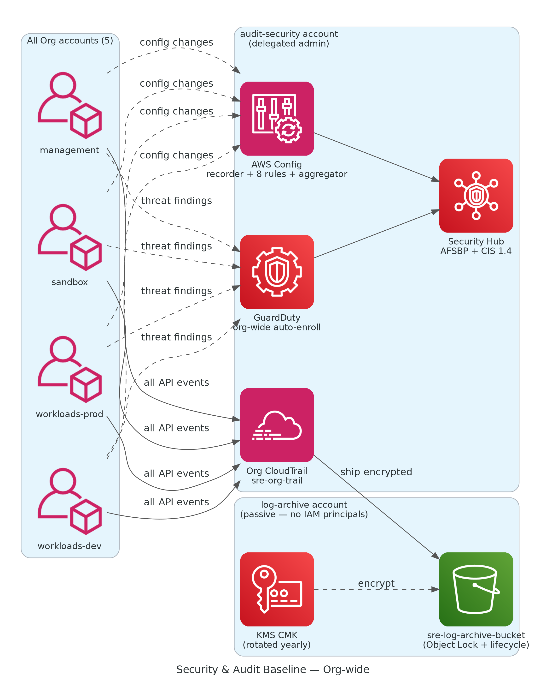
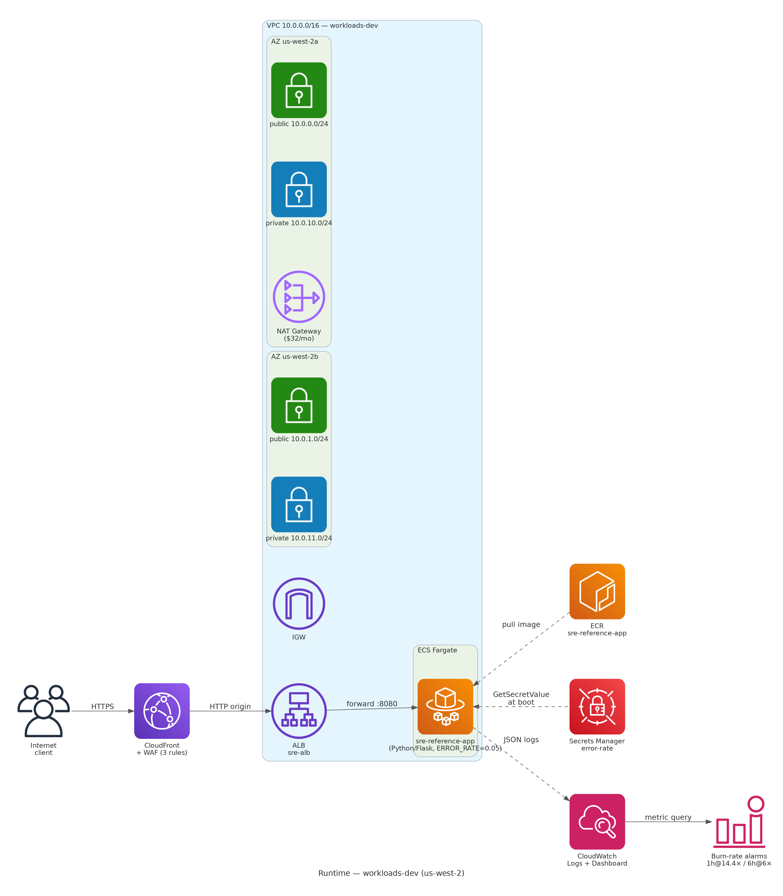
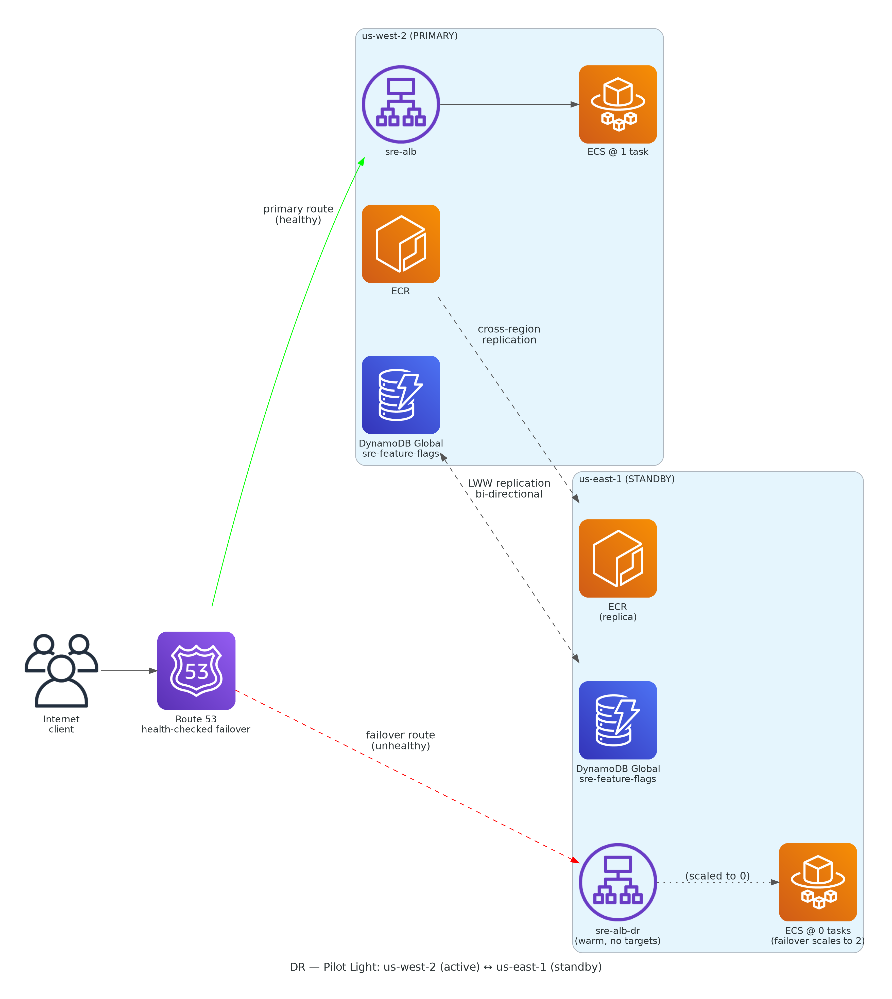
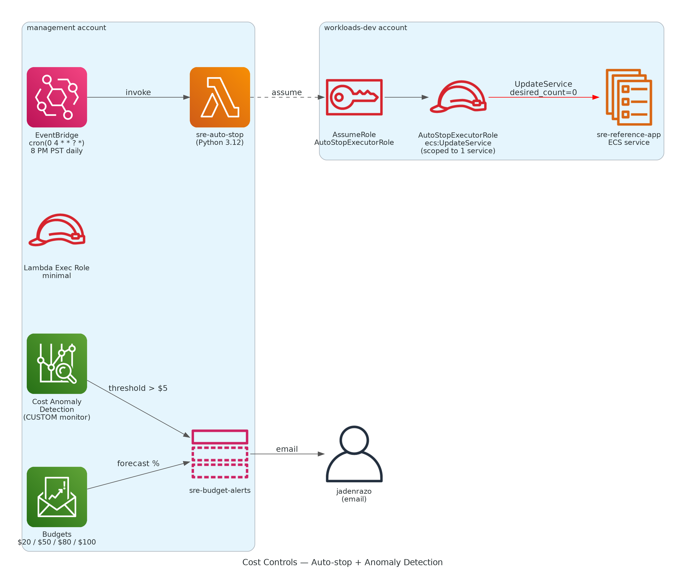
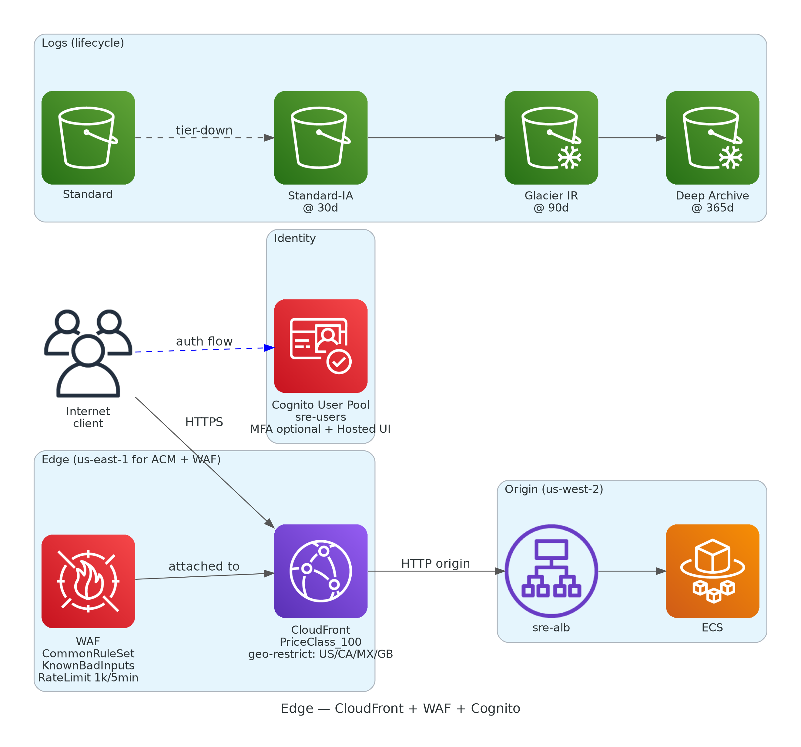

# Architecture (after): multi-account landing zone

The end-state — what `sre-landing-zone` looks like after Phases 0–6 are applied.

## Topology summary

| Layer | Component |
|---|---|
| Org | AWS Organization `o-9itq8iim1q`, 5 accounts (mgmt + log-archive + audit-security + workloads-dev + workloads-prod), 4 SCPs at OU level |
| Identity | IAM Identity Center in us-west-2 with 4 permission sets: AdminAccess, PowerUserAccess, ReadOnlyAccess, BillingOnly |
| Audit | Org CloudTrail to KMS-encrypted S3 in log-archive (Object Lock + lifecycle to Glacier Deep Archive at 365d) |
| Security | GuardDuty + Security Hub delegated to audit-security, AFSBP + CIS standards, AWS Config aggregator with 8 managed rules |
| Workload (active) | workloads-dev us-west-2: VPC 10.0.0.0/16, ALB, ECS Fargate, ECR, Secrets Manager, CloudWatch dashboard + 2 burn-rate alarms |
| DR (standby) | workloads-dev us-east-1: VPC 10.20.0.0/16, ALB warm, ECS @ 0 tasks, ECR replica, DynamoDB Global Table, Route 53 health checks |
| Edge | CloudFront (PriceClass_100) + WAF (CommonRuleSet, KnownBadInputs, RateLimit 1k/5min) + Cognito User Pool with Hosted UI |
| Cost | EventBridge → Lambda auto-stop (cross-account assume-role), Cost Anomaly Detection (CUSTOM monitor), Budgets at 20/50/80/100% |

## The four data planes

### Audit data plane

Every API call across all 5 accounts → Org CloudTrail → S3 in log-archive (KMS-encrypted, lifecycle-tiered). Config records resource state changes; GuardDuty + Security Hub aggregate threat findings + compliance posture in audit-security. **The log-archive account has no IAM principals beyond the org admin role** — that's intentional. Compromise of any workload account doesn't compromise the audit trail.

### Runtime data plane

Internet → CloudFront (with WAF inspecting every request) → ALB → ECS Fargate task in private subnet. Task pulls image from ECR, fetches the `ERROR_RATE` config from Secrets Manager at boot, ships JSON logs to CloudWatch. Burn-rate alarms compute error_rate from ALB request metrics.

### DR data plane

Pilot Light pattern. us-west-2 is active. us-east-1 has full infrastructure provisioned (ALB, ECS task definition) but ECS service runs at `desired_count=0`. Failover = `aws ecs update-service --desired-count 2`. Route 53 health checks watch both ALBs; failover record swap is the one piece needing a real domain (we run health checks but don't currently route).

### Cost-control data plane

EventBridge cron @ 8 PM PST → Lambda → assumes `AutoStopExecutorRole` in workloads-dev → scales `sre-reference-app` to 0. Lambda's mgmt-side role has only `sts:AssumeRole`; the executor role has only `ecs:UpdateService` scoped to ONE service. Cost Anomaly Detection (CUSTOM monitor scoped to the project's tag) routes anomalies > $5 to the existing budget-alerts SNS topic.

### Edge data plane

CloudFront fronts the ALB. WAF (in us-east-1 — required by AWS for CloudFront-attached web ACLs) inspects each request: managed rules block OWASP Top 10 patterns + known bad inputs, custom rule rate-limits per IP. Cognito User Pool exists for hypothetical `/admin` route gating; Hosted UI loads at `https://sre-landing-zone-422783588447.auth.us-west-2.amazoncognito.com/login`. S3 lifecycle on the log-archive bucket tiers data Standard → IA → Glacier IR → Deep Archive.
