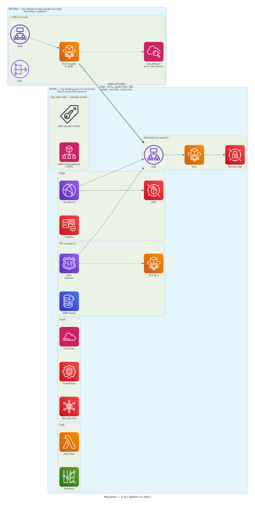

# 6 R's analysis — sre-reference-app → sre-landing-zone

The 6 R's framework (Gartner / AWS Migration Strategy) classifies each component of a workload migration. We apply it retrospectively to the move from single-account `sre-reference-app` (the GameDay snapshot) to multi-account `sre-landing-zone`.

## Component-by-component classification

| Component (before) | Decision | What changed | Justification |
|---|---|---|---|
| Python Flask app (`main.py`) | **Retain** | Same code, no changes | Already cloud-native — just changed the deployment target |
| Dockerfile | **Retain** | Same image, just pushed to a different ECR | Containerization was already done correctly |
| ECS Fargate cluster | **Replatform** | Same launch type, new account + region target, new IAM role naming | Lift the platform shape but re-target to multi-account model |
| ECR repository | **Replatform** | Now in workloads-dev account; cross-region replication to us-east-1 | Single-region → multi-region replication added |
| ALB | **Replatform** | Same ALB type, now sits behind CloudFront | Edge layer added in front, ALB now an origin-only resource |
| VPC + subnets + NAT | **Replatform** | New CIDRs, new account, single-AZ NAT discipline | Network re-architected for cost discipline + DR pattern |
| `ERROR_RATE` env var | **Refactor** | Moved from Docker-env to AWS Secrets Manager | Demonstrates secret rotation + KMS encryption + IAM-scoped access |
| CloudWatch dashboard | **Retain** | Same widgets, same metrics | Already correctly shaped |
| Burn-rate alarms (1h@14.4×, 6h@6×) | **Retain** | Same SLO math, same alarm structure | The Google SRE Workbook pattern doesn't change |
| GitHub Actions OIDC role | **Replatform** | Now federates into workloads-dev (not mgmt) | Same OIDC pattern, new trust boundary |
| Single AWS account model | **Repurchase** (in 6 R's terms: AWS Organizations replaces the implicit "one account does everything" model) | 1 account → 5 accounts (mgmt + log-archive + audit-security + workloads-dev + workloads-prod) | Adopt the AWS Well-Architected separation pattern |
| Per-app CloudWatch logs | **Retain** + **add audit layer** | Same per-app logs in workloads-dev; org-wide CloudTrail added in log-archive | Workload observability unchanged; audit observability added on top |
| (No SCPs) | **New capability** (not a 6 R's pattern — a gap fill) | 4 SCPs at OU level: deny-root, deny-non-approved-regions, IMDSv2, deny-disabling-security-services | Preventive controls — Domain 1 of SAA |
| (No central audit) | **New capability** | Org CloudTrail + GuardDuty + Security Hub + Config aggregator | Detective controls |
| (No DR) | **New capability** | us-east-1 standby with ECR replication, DynamoDB Global Table, Route 53 health checks | Resilient Architecture — Domain 2 of SAA |
| (No edge) | **New capability** | CloudFront + WAF + Cognito | Performance + Security |
| (Manual cost discipline) | **New capability** | EventBridge + Lambda auto-stop, Cost Anomaly Detection, Budgets | Cost-Optimized Architecture — Domain 4 of SAA |

## Counts by decision

| 6 R's decision | Components |
|---|---|
| **Retain** | 5 (app code, Dockerfile, dashboard, burn-rate alarms, app-level logs) |
| **Replatform** | 5 (ECS, ECR, ALB, VPC/network, OIDC role) |
| **Refactor** | 1 (env var → Secrets Manager) |
| **Repurchase** | 1 (single-account model → AWS Organizations) |
| **Retire** | 0 |
| **Rehost** | 0 (no lift-and-shift VMs) |
| **New capabilities** | 5 (SCPs, audit, DR, edge, cost controls) |

## Why mostly Retain/Replatform — and what the new capabilities mean

`sre-reference-app` was already containerized, cloud-native, and fronted by an ALB. There was nothing to **rehost** (no VMs) and nothing to **retire** (no legacy components). The actual migration value comes from the **new-capability layer** stacked on top: the Day-2 production posture (audit, DR, edge, cost) that didn't exist in the snapshot.

In a real engagement, this is the harder conversation to have with stakeholders: "the migration itself is mostly invisible — what we're actually doing is paying down the missing-platform-controls debt." The 6 R's classification makes that explicit.

## What we'd do differently in production

- **Rehost a legacy component for the demo.** Including a deliberately-legacy artifact (e.g., a Node 14 app, an EC2-based SQL Server) and rehosting it would round out the 6 R's coverage.
- **Repurchase a managed alternative.** E.g., move from self-hosted Postgres to RDS Aurora — but Aurora's $43/mo minimum violated the budget, so out of scope here.
- **Retire dead code paths.** Real migrations always find these; `sre-reference-app` was too small to have any.
